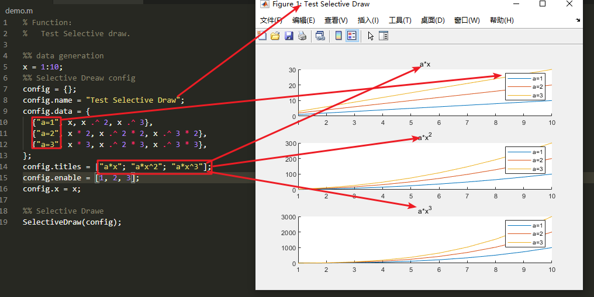

# SelectiveDraw
Selective draw to compare different cases.
[中文](./README-cn.md)
## Usage
```matlab
%% data generation
x = 1:10;
%% Selective Dreaw config
config = {};
config.name = "Test Selective Draw";
config.data = {
  {"a=1", x, x .^ 2, x .^ 3},
  {"a=2", x * 2, x .^ 2 * 2, x .^ 3 * 2},
  {"a=3", x * 3, x .^ 2 * 3, x .^ 3 * 3},
};
config.titles = ["a*x"; "a*x^2"; "a*x^3"];
config.enable = [1, 2, 3];
config.x = x;

%% Selective Drawe
SelectiveDraw(config);
```

| parameter     | description                                                  |
| ------------- | ------------------------------------------------------------ |
| config.name   | figure title                                                 |
| config.data   | data config, first element is the sub figure title, others are arrays to draw. |
| config.titles | legends corresponding to arrays                              |
| x             | optional, used as the x-axis data, if not set, array indexes will be used. |

## Screenshot

